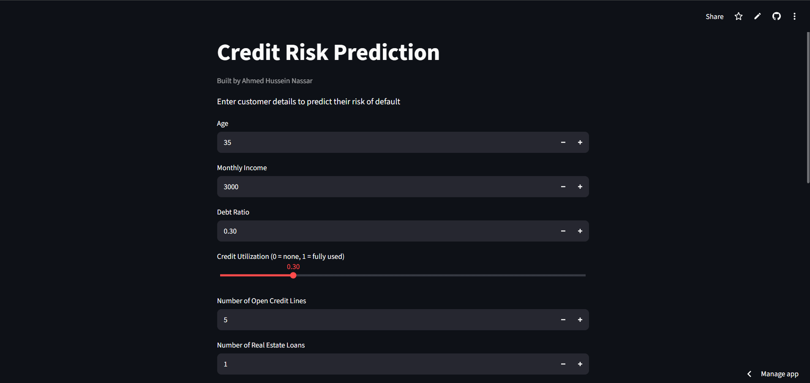
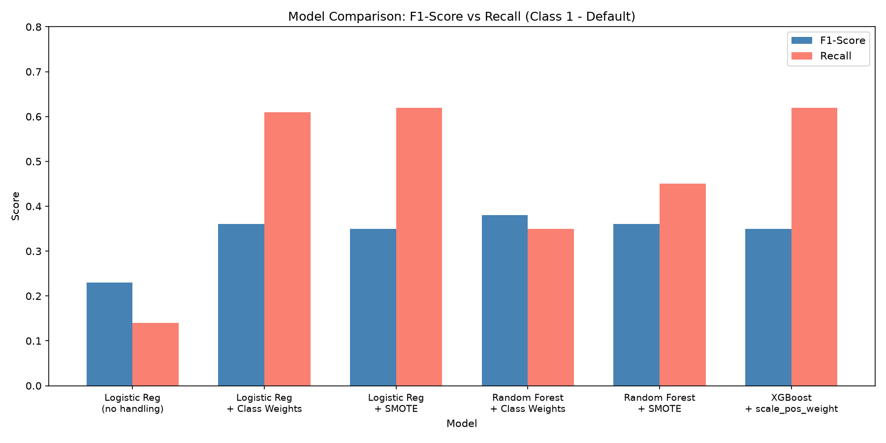
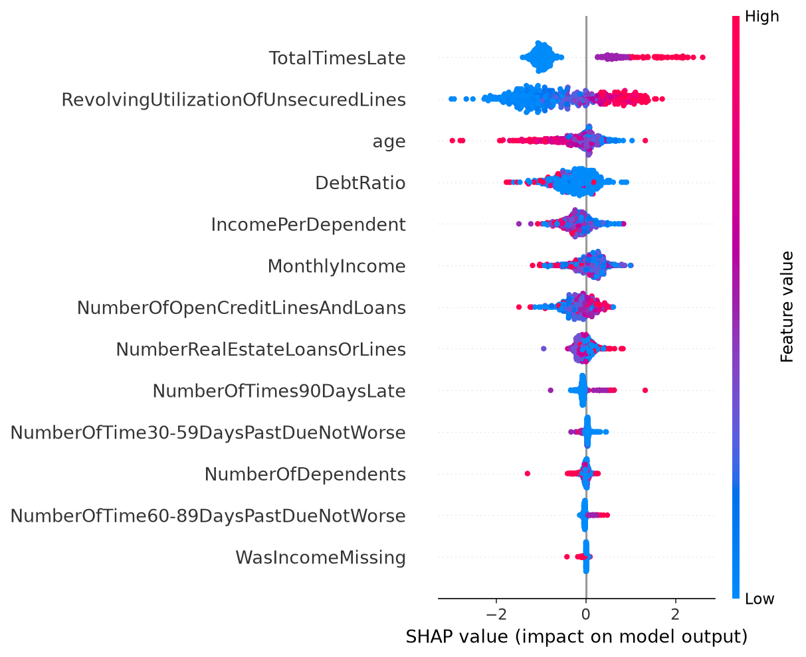

# Credit Risk Prediction

🔗 **[Try the live app here](https://credit-risk-ahmed.streamlit.app)**

ML system for credit risk assessment with model comparison and explainability.



## Problem

Predict whether a customer will experience serious financial distress (default) within two years, based on their financial and personal history. Built on real-world data (~150K records) with severe class imbalance (~93% no default vs ~7% default).

## Project Structure

| File | Description |
|---|---|
| `explore_data.ipynb` | Full EDA, feature engineering, model training and comparison, SHAP analysis |
| `api.py` | FastAPI backend serving the trained model |
| `app.py` | Streamlit web interface for interactive predictions |
| `xgb_model.pkl` / `scaler.pkl` | Saved final model and scaler used by the API and app |
| `data/cs-training.csv` | Training dataset |

## Approach

1. **EDA & Cleaning**: Handled missing values (median/mode imputation), removed invalid entries (e.g. age = 0), fixed sentinel values (96/98 codes), and quantified the class imbalance.
2. **Feature Engineering**: Built `TotalTimesLate` (combining all late-payment counters), which raised correlation with the target from 0.31 to 0.39.
3. **Model Comparison**: Trained and compared 6 model variants across 3 algorithms, testing different imbalance-handling strategies (Class Weights vs SMOTE).
4. **Explainability**: Used SHAP to interpret model decisions, both globally and for individual predictions.
5. **Deployment**: Exposed the final model via a FastAPI endpoint and a Streamlit web interface, deployed live on Streamlit Community Cloud.

## Key Findings

- **A hidden data quality issue**: While investigating outliers in `DebtRatio`, values above 1000 turned out to correlate almost perfectly with customers whose `MonthlyIncome` had originally been missing (later imputed with the median). Rather than capping or dropping these rows, a `WasIncomeMissing` flag was added so the model could learn from the pattern directly, instead of being misled by a distorted ratio.
- **Imbalance handling matters more than model complexity**: Every tested model improved recall significantly once class imbalance was addressed — regardless of algorithm. XGBoost and Random Forest did not meaningfully outperform Logistic Regression once imbalance was properly handled, showing that on this dataset, handling imbalance mattered more than model complexity.
- **Deep Learning was tried and deliberately dropped**: A PyTorch neural network was trained and evaluated (Recall: 0.63, F1: 0.34). It did not outperform XGBoost enough to justify the added complexity on this tabular dataset, so it was excluded from the final pipeline in favor of a simpler, more interpretable model.

## Model Comparison

| Model | Accuracy | Recall (Default) | Precision (Default) | F1-Score (Default) |
|---|---|---|---|---|
| Logistic Regression (no handling) | 93.7% | 0.14 | 0.62 | 0.23 |
| Logistic Regression + Class Weights | 85.9% | 0.61 | 0.26 | 0.36 |
| Logistic Regression + SMOTE | 84.9% | 0.62 | 0.25 | 0.35 |
| **Random Forest + Class Weights** | 92.6% | 0.35 | 0.42 | **0.38** |
| Random Forest + SMOTE | 89.5% | 0.45 | 0.30 | 0.36 |
| **XGBoost + scale_pos_weight** | 84.6% | **0.62** | 0.24 | 0.35 |



**Final model: XGBoost.** In credit risk, missing an actual defaulter (false negative) is costlier than rejecting a good customer (false positive), so recall was prioritized over raw accuracy. XGBoost also integrates well with SHAP for explainability.

## Explainability (SHAP)



Payment history (`TotalTimesLate`) and credit utilization are the strongest predictors of default risk, consistent with domain intuition. Older age and low credit utilization consistently push predictions toward "low risk."

## Tech Stack

Python · Pandas · Scikit-learn · XGBoost · SHAP · FastAPI · Streamlit · Jupyter

## Run Locally

```bash
git clone https://github.com/ahmed-hussein02/credit-risk-prediction.git
cd credit-risk-prediction
python -m venv venv
venv\Scripts\activate
pip install -r requirements.txt
streamlit run app.py
```

## Author

**Ahmed Hussein Nassar**
[GitHub](https://github.com/ahmed-hussein02) | [LinkedIn](https://www.linkedin.com/in/ahmed-hussein-2a5422329)